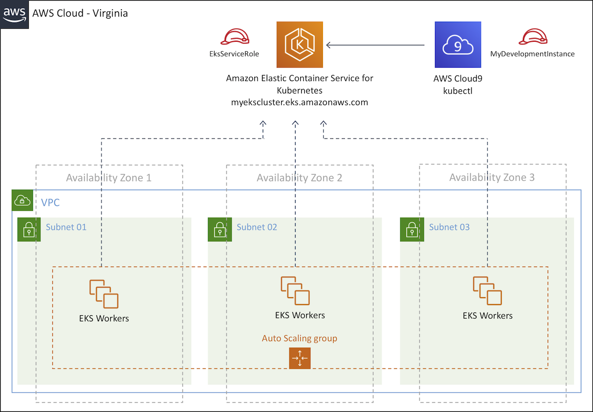

# Immersion Day Core Services

Hello, this is a self-paced workshop designed to explore Amazon EKS.

## Modules

This workshop is broken up into multiple modules. you must complete the following modules in **US East (N. Virginia)** region in order before proceeding to the next:

1\. [EKS Prerequisites](tutorials/eks-prerequisites.md)

2\. [Prepare your development environment](tutorials/prepare-your-development-environment.md)

3\. [Create an Amazon EKS Cluster](tutorials/eks-cluster.md)
