# Create an Amazon EKS Cluster

## 1. Creating an Amazon EKS Cluster from Cloud9 environment

1.1\. Inside the Cloud9 environment we are going to create the eks cluster, run the following command inside the **bash** terminal, replace with your corresponding values:

* **``<Role ARN>``**: With the ARN Role from **EksServiceRole**.
* **``<Output-SubnetIds>``**: Replace with the output value copied from Cloudformation stack **eks-vpc**.
* **``<Output-SecurityGroups>``**: Replace with the output value copied from Cloudformation stack **eks-vpc**.

```
aws eks create-cluster --name myEKSCluster --role-arn <Role ARN> --resources-vpc-config subnetIds=<Output-SubnetIds>,securityGroupIds=<Output-SecurityGroups> --region us-east-1 --kubernetes-version 1.11
```
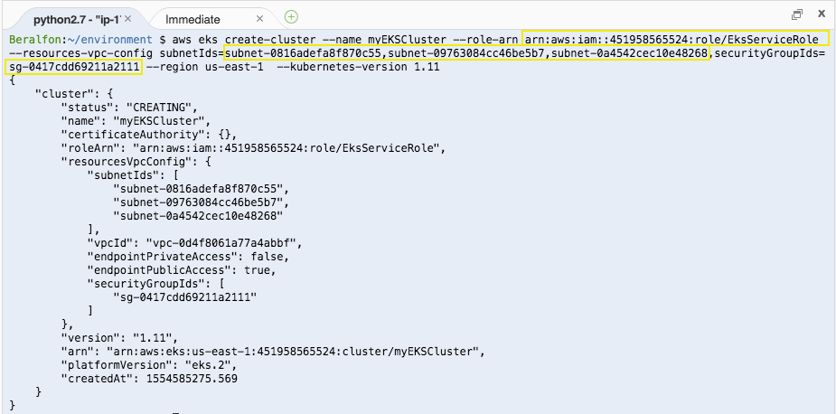

**Note**: This may take up to 10 minutes as the cluster is being created, once is available you can continue.

1.7\. Open the Amazon EKS console at https://console.aws.amazon.com/eks/, choose **myEKSCluster**, you will see the information of our EKS cluster as follows.

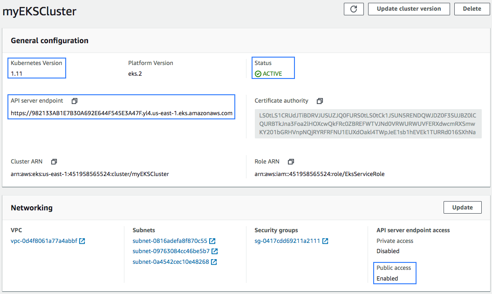

1.8\. In your Cloud9 environment use the AWS CLI **update-kubeconfig** command to create or update your kubeconfig for your cluster.

```
aws eks --region us-east-1 update-kubeconfig --name myEKSCluster
```

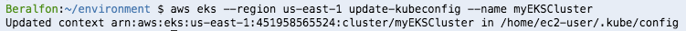

1.9\. Test your configuration.

```
kubectl get svc
```

## 2. Launching Amazon EKS Worker Nodes

2.1\. Open the AWS CloudFormation console at https://console.aws.amazon.com/cloudformation.

2.2\. Choose **Create stack**.

2.3\. For Choose a template, **select Specify an Amazon S3 template URL** and paste the following URL into the text area and choose **Next**:

```
https://amazon-eks.s3-us-west-2.amazonaws.com/cloudformation/2019-02-11/amazon-eks-nodegroup.yaml
```

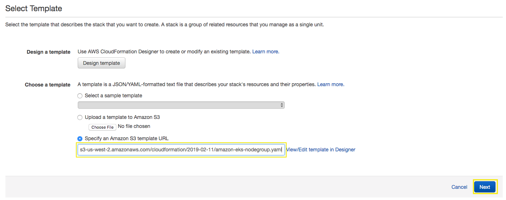

2.4\. On the **Specify Details** page, fill out the following parameters accordingly, and choose **Next**:

  * **``Stack name``**: `myEKSCluster-worker-nodes`
  * **``ClusterName``**: `myEKSCluster`
  * **``ClusterControlPlaneSecurityGroup``:** Select the security group created from the Cloudformation stack **eks-vpc**
  * **``NodeGroupName``**: `workerNodes`
  * **``NodeImageId``**: `ami-02c1de421df89c58d`
  * **``KeyName``**: Select your Key Pair
  * **``VpcId``**: Select the VPC created from the Cloudformation stack **eks-vpc**
  * **``Subnets``**: Select the three subnets created from the Cloudformation stack **eks-vpc**

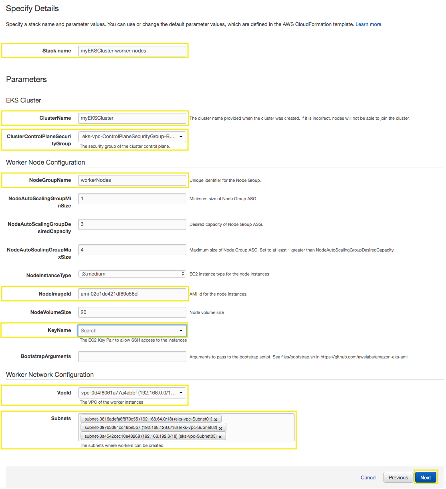

2.5\. On the **Options** page, you can choose to tag your stack resources. Choose **Next**.

2.6\. On the **Review** page, review your information, acknowledge that the stack might create IAM resources, and then choose **Create**.

2.7\. When your stack has finished creating, select it in the console and choose **Outputs**.

2.8\. Copy the **NodeInstanceRole** value for the node group that was created. You will need this to configure your Amazon EKS worker nodes.

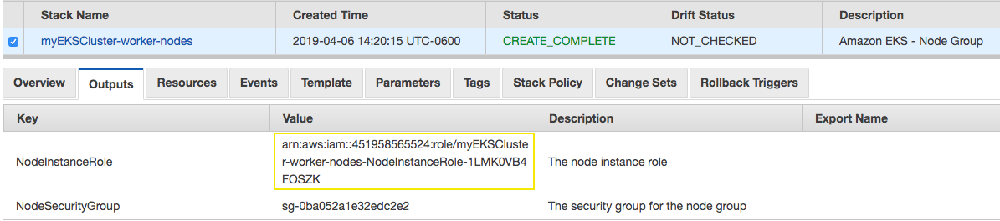

## 3. Enable worker nodes to join your cluster

3.1\. Inside the Cloud9 environment, download the AWS IAM Authenticator configuration map with the following command:

```
curl -o aws-auth-cm.yaml https://amazon-eks.s3-us-west-2.amazonaws.com/cloudformation/2019-02-11/aws-auth-cm.yaml
```

3.2\. Open the file with the text editor included in Cloud9. Replace the **<ARN of instance role (not instance profile)>** snippet with the **NodeInstanceRole** value that you copied in the previous procedure, and save the file.

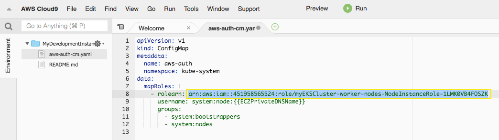

3.3\. Apply the configuration. This command may take a few minutes to finish to have all the nodes in **Ready** status.

```
kubectl apply -f aws-auth-cm.yaml
```

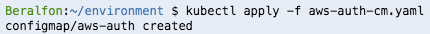

3.4\. Watch the status of your nodes and wait for them to reach the **Ready** status.

```
kubectl get nodes
```
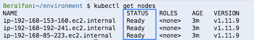

## 4. Add an Autoscaling policy for the worker nodes

4.1\. Open the Amazon EC2 console at https://console.aws.amazon.com/ec2/.

4.2\. On the navigation pane, under **AUTO SCALING**, choose **Auto Scaling Groups**.

4.3\. Select your Auto Scaling group and on the **Scaling Policies** tab, choose **Add policy**.

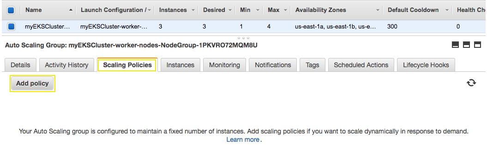

4.3\. For **Name**, type `Scale-80`, for **Metric type** select **Average CPU Utilization** and a **Target value** of `80`, and choose **Create**.

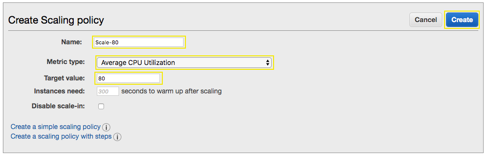

4.4\. After some minutes your auto scaling group will have only one instance for the worker node.

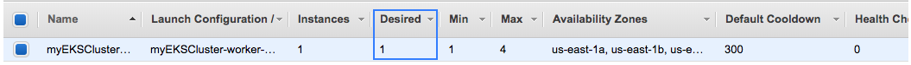

## 5. Deploy the example Microservices 

Before proceed, in your Cloud9 environment clone the following service repos:

```
cd ~/environment
git clone https://github.com/brentley/ecsdemo-frontend.git
git clone https://github.com/brentley/ecsdemo-nodejs.git
git clone https://github.com/brentley/ecsdemo-crystal.git
```

Continue here: **[Deploy the example Microservices](https://eksworkshop.com/deploy/)**

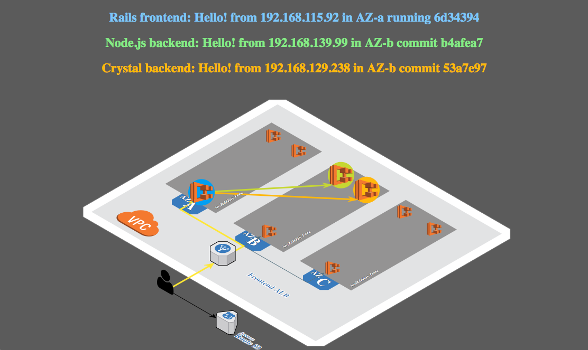

## 6. Deploy the Kubernetes Dashboard

[Deploy the official Kubernetes dashboard](https://eksworkshop.com/dashboard/)

**Note**: When you request the token with aws-iam-authenticator, change **eksworkshop-eksctl** with the name of your cluster: **``myEKSCluster``**

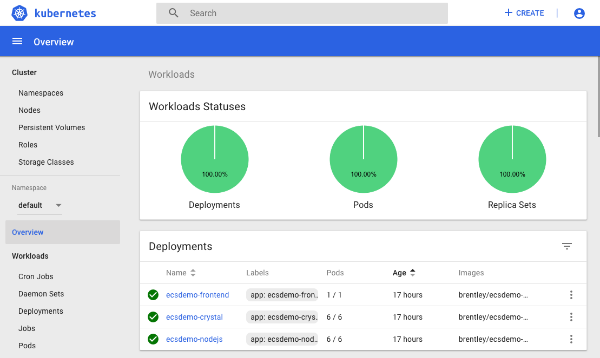

## Useful Links
* [Creating an Amazon EKS Cluster](https://docs.aws.amazon.com/eks/latest/userguide/create-cluster.html)
* [Launching Amazon EKS Worker Nodes](https://docs.aws.amazon.com/eks/latest/userguide/launch-workers.html)
