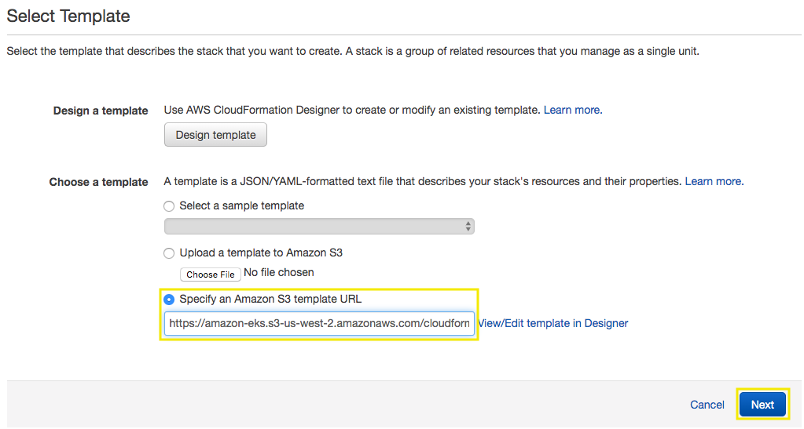
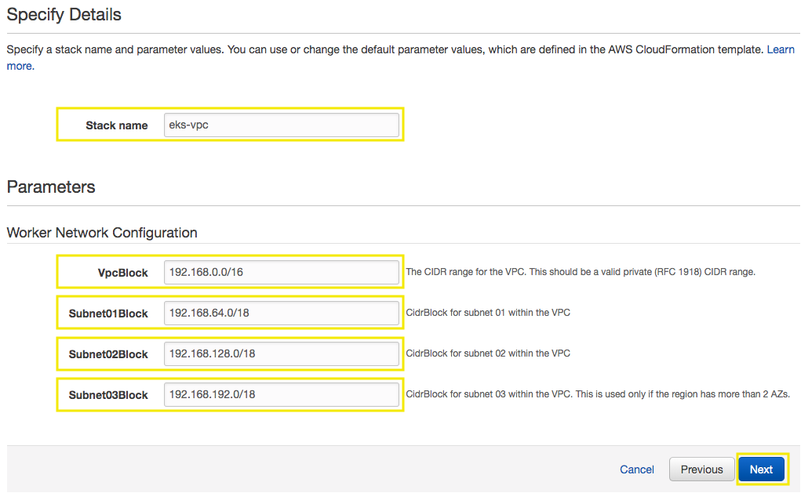
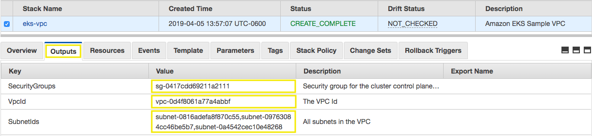
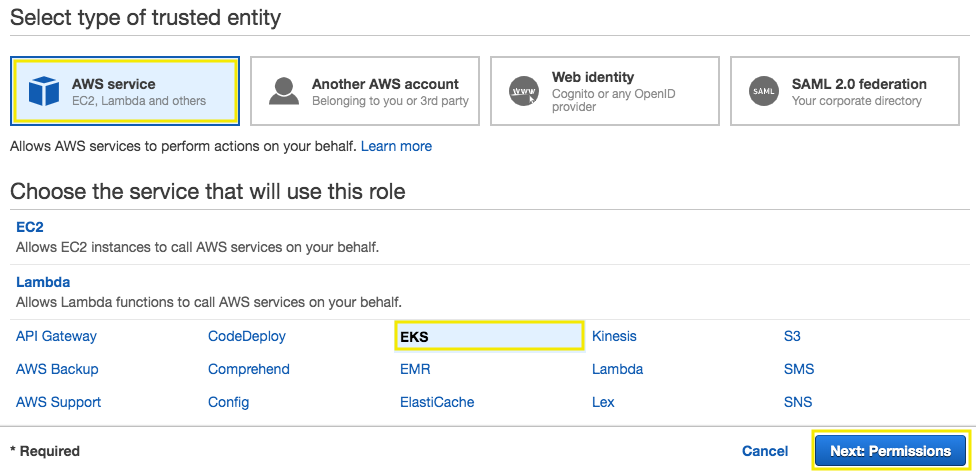
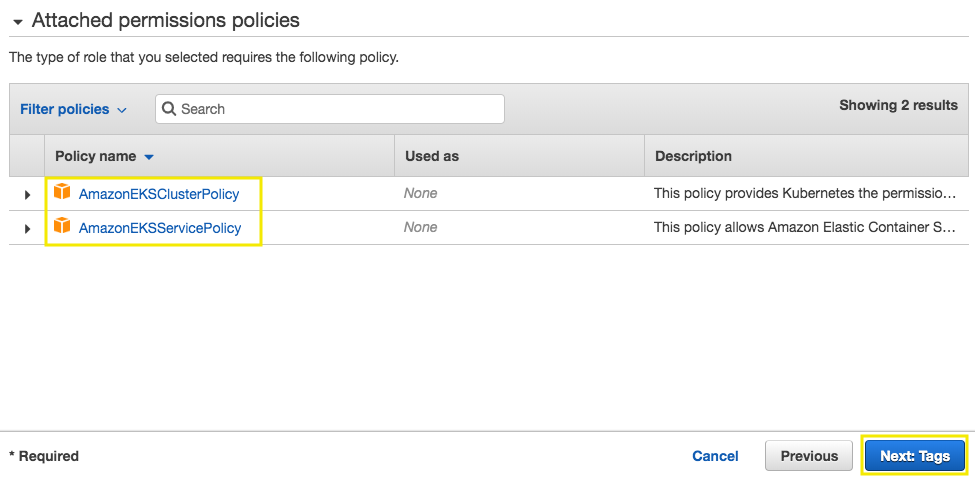

# EKS Prerequisites

## 1. Create your Amazon EKS Cluster VPC

1.1\. Open the AWS CloudFormation console at https://console.aws.amazon.com/cloudformation.

1.2\. From the navigation bar, select a Region that supports Amazon EKS.

1.3\. Choose **Create stack**.

1.4\. For **Choose a template**, select **Specify an Amazon S3 template URL**.

1.5\. Paste the following URL into the text area and choose **Next**:

```
https://amazon-eks.s3-us-west-2.amazonaws.com/cloudformation/2019-02-11/amazon-eks-vpc-sample.yaml
```



1.6\. On the **Specify Details** page, fill out the parameters accordingly, and then choose **Next**.

  * **Stack name**: `eks-vpc`.

  * **VpcBlock**: Choose a CIDR range for your VPC. **Keep the default value** `192.168.0.0/16`.

  * **Subnet01Block**: Choose a CIDR range for subnet 1. **Keep the default value** `192.168.64.0/18`.

  * **Subnet02Block**: Choose a CIDR range for subnet 2. **Keep the default value** `192.168.128.0/18`.
  
  * **Subnet03Block**: Choose a CIDR range for subnet 3. **Keep the default value** `192.168.192.0/18`.



1.7\. On the Options page, choose **Next**.

1.8\. On the **Review** page, choose **Create**.

1.9\. When your stack is created, select it in the console and choose **Outputs**.

From the outputs stack, copy the following values, you will need them later.

  * **SecurityGroups**: You need this when you create your EKS cluster; this security group is applied to the cross-account elastic network interfaces that are created in your subnets that allow the Amazon EKS control plane to communicate with your worker nodes.
  * **VpcId**: You need this when you launch your worker node group template.
  * **SubnetIds**: You need this when you create your EKS cluster; these are the subnets that your worker nodes are launched into.



## 2. Create your Amazon EKS Service Role

2.1\. Open the IAM console at https://console.aws.amazon.com/iam/.

2.2\. Choose **Roles**, then **Create role**.

2.3\. Choose **EKS** from the list of services, then Allows Amazon EKS to manage your clusters on your behalf for your use case, then **Next: Permissions**.



2.4\. The policies required are selected by default: **AmazonEKSClusterPolicy** and **AmazonEKSServicePolicy**, choose **Next: Tags**.



2.5\. For **Add tags** choose **Next: Review**.

2.6\. Give your role a **Name**, type `EksServiceRole` and choose **Create Role**.