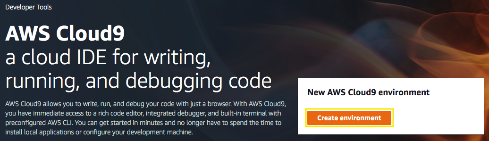

# Prepare your development environment

## 1. Create a Cloud9 instance for development

1.1\. Open the AWS Cloud9 console at https://console.aws.amazon.com/cloud9/.

1.2\. Click on **Create environment**.



1.3\. For the **Name** type `MyDevelopmentInstance`, and choose **Next step**.


1.4\. For the **Environment settings** use the default values and choose **Next step**.

1.5\. Click on **Create environment**.

1.6\. Wait some seconds until your development environment is ready, you will see the following screen.


## 2. Create your Amazon EC2 Service Role for the Cloud9 instance.

2.1\. Open the IAM console at https://console.aws.amazon.com/iam/.

2.2\. Choose **Roles**, then **Create role**.

2.3\. Choose **EC2** from the list of services, then **Next: Permissions**.


2.4\. For **Attach permissions policies** select **Administrator Access**, choose **Next: Tags**.


2.5\. For **Add tags** choose **Next: Review**.

2.6\. Give your role a **Name**, type `MyDevelopmentInstance` and choose **Create Role**.


## 3. Attach the IAM role to instance

3.1\. Open the Amazon EC2 console at https://console.aws.amazon.com/ec2/.

3.2\. In the navigation pane, choose **Instances**.

3.3\. Select your Cloud9 instance, choose **Actions**, **Instance Settings**, **Attach/Replace IAM role**.


3.4\. Select the IAM role **MyDevelopmentInstance** to attach to your instance, and choose **Apply**.


## 4. Install requirements

4.1\. Open the AWS Cloud9 console at https://console.aws.amazon.com/cloud9/.

4.2\. In the list of environments, for the environment you want to open, inside of the card, choose **Open IDE**.


4.3\. Inside the Cloud9 environment, in the **bash** terminal we are goint to install the **kubectl** command line for Kubernetes, execute the following lines:

```
curl -LO https://storage.googleapis.com/kubernetes-release/release/v1.14.0/bin/linux/amd64/kubectl
chmod +x ./kubectl
sudo mv ./kubectl /usr/local/bin/kubectl
```

4.4\. After you install **kubectl**, you can verify its version with the following command:

```
kubectl version --short --client
```


4.5\. Now install the **aws-iam-authenticator** for Amazon EKS, execute the following lines:

```
curl -o aws-iam-authenticator https://amazon-eks.s3-us-west-2.amazonaws.com/1.12.7/2019-03-27/bin/linux/amd64/aws-iam-authenticator
chmod +x ./aws-iam-authenticator
sudo mv ./aws-iam-authenticator /usr/local/bin/aws-iam-authenticator
```

4.6\. Test that the **aws-iam-authenticator** binary works with the following command:

```
aws-iam-authenticator help
```


## 5. Update IAM settings for your Cloud9 Environment

5.1\. Inside the Cloud9 environment, click on **AWS Cloud9** and **Preferences**.


5.2\. Select **AWS SETTINGS** and turn off **AWS managed temporary credentials**.


5.3\. Ensure temporary credentials aren’t already in place, remove existing credentiasl with the following command:

```
rm -vf ${HOME}/.aws/credentials
```

5.4\. Validate the IAM role, it should contain the role name and instance Id, run the following command:

```
aws sts get-caller-identity
```


## Useful Links
* [Installing kubectl](https://docs.aws.amazon.com/eks/latest/userguide/install-kubectl.html)
* [Installing aws-iam-authenticator](https://docs.aws.amazon.com/eks/latest/userguide/install-aws-iam-authenticator.html)